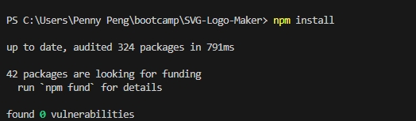
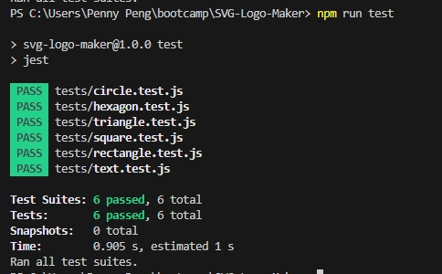
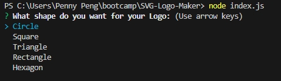
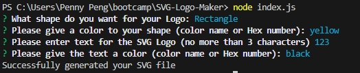
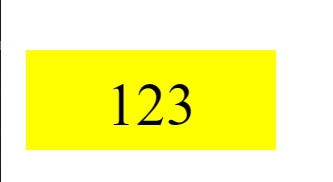

# SVG-Logo-Maker

## Description

an app can generate SVG Logo with simple shape and color.

## Table of Contents

- [Installation](#installation)
- [Usage](#usage)
- [License](#license)
- [Contribution](#contribution)
- [Test](#test)
- [Further Questions](#furtherquestions)

## Installation

Open the directory from VS Code.

1. install Inquirer & Jest:

  

2. run Jest to run the test:

  

3. run index.js to start the logo maker with questions:

  
  

4. SVG logo generated with user`s input:

  

Here is a video tour of how to install and use the application:   
https://drive.google.com/file/d/14AcDgentCSzzgj3vNC_5FJa84KifaJEO/view

## Usage

- to generate a SVG logo.
- after run the index.js, several questions prompted to make sure the user answer all the important questions for a desired SVG Logo.
- a SVG Logo is gerated after you see the successful information, a new file called logo.svg is generated in the main folder.

## License

N/A

## Contribution
You can contribute to this application by revising the codes here:  
https://github.com/mkdkck/SVG-Logo-Maker

## Test
N/A

## FurtherQuestions

please review the codes here：  
https://github.com/mkdkck/SVG-Logo-Maker

or contact the owner via: colin173@gmail.com

## Badges

